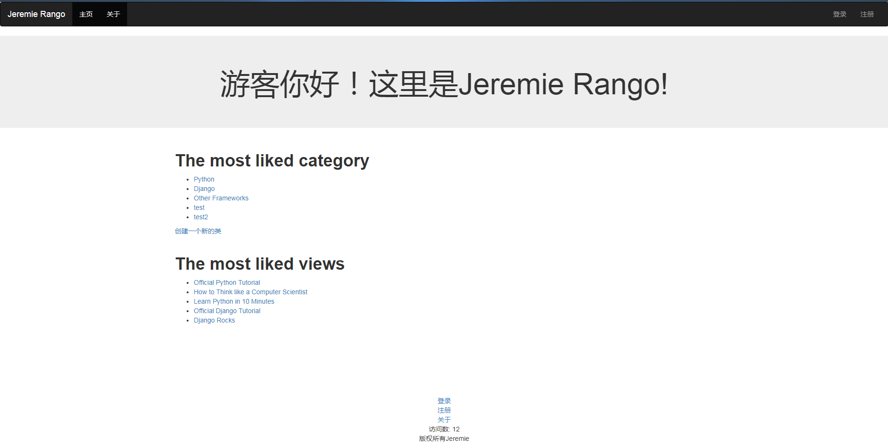
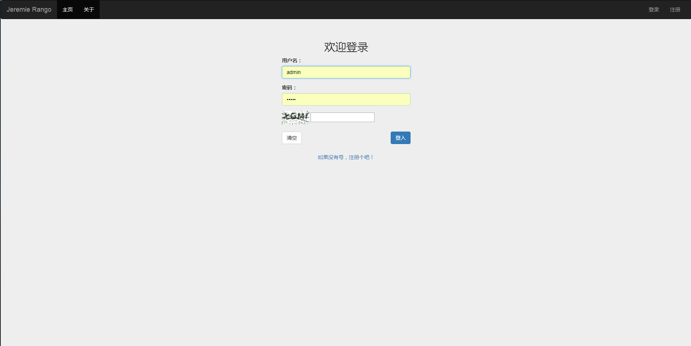

# Django2 News Project
> 一个前后端结合的小WEB项目，功能类似于新闻发布网站

类似的项目有《How to Tango with Django》，可惜电子书版本是django1.7的，网上也没有版本为django2的电子书，要上[官网](https://leanpub.com/tangowithdjango2)买很麻烦。这里我进行了版本的转换和代码的调整，代码的主体框架也是参考这本书的，在此之上额外添加功能。难度不大，适合新手去编写。

## 环境
- Python3.6
- Django2.1
- bootstrap3.3
- jquery-3.4

## 基本
- 文章类别创建
- TOP5文章
- 登入、登出、注册机
- 用户信息反馈
- 验证码机制
- 版权、访问数
- 页面间交互
- 个人关于

## 继续
- 邮箱、短信注册
- 更改密码

## 使用方法

- 下载项目后，cd到项目路径，然后输入`python manage.py runserver`,并在浏览器输入`http://127.0.0.1:8000/rango/`即可，rango是主页名字。

## 网站展示
#**主页**

#**登入界面**

